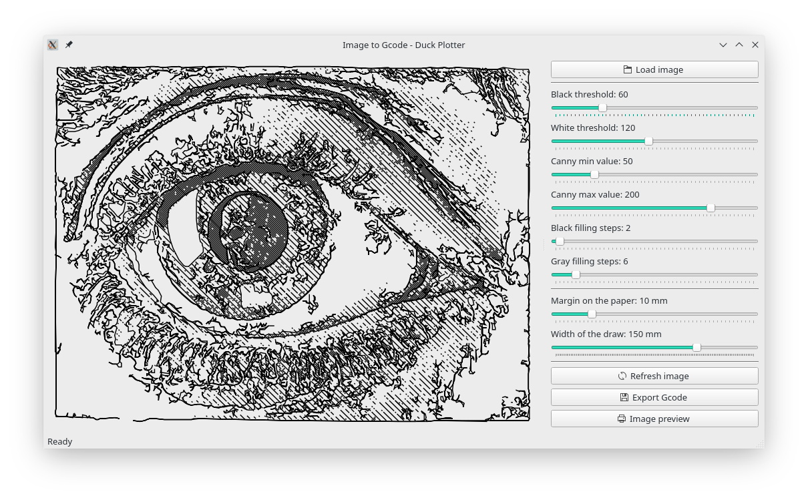

# Image to gcode - Duck Plotter

This project aims at transforming every image in a gcode file after finding the best configuration and quality.
The resulting file can then be sent to the [Duck Plotter](https://github.com/davidezanella/DuckPlotter) to draw it on the paper.

## How to use it
First of all install the necessary requirements
```bash
pip3 install -r requirements.txt
```

Run the program
```bash
python3 main.py
```

Choose an image, tune the settings and find the best ones.

To verify the dimensions of the final image in a A4 paper click on the button "Image preview".

Export the results as a gcode file using the specific button.



